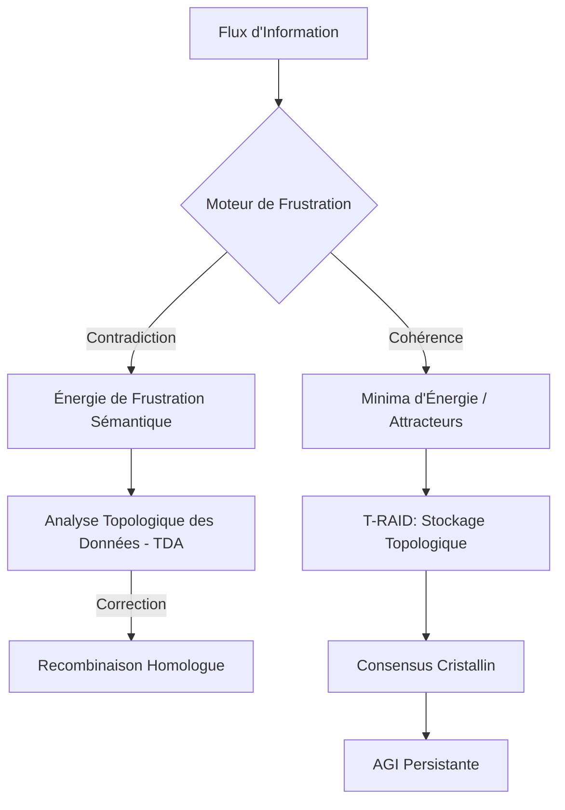

# 🧬 Phoenix-Omega : Architecture Cognitive à États Exotiques (ACEE)


## 🌟 Synopsis
Le **Projet PHŒNIX-OMEGA** est une rupture paradigmatique visant à résoudre "l'amnésie antérograde" des modèles de langage actuels. En transcendant le stockage binaire classique pour exploiter la **Physique de la Matière Condensée**, PHŒNIX-OMEGA transforme la mémoire de l'IA en une structure dynamique hors équilibre. 

L'architecture passe d'un système de stockage statique (v1.0 Genesis) à une **Matière Cognitive Programmable** capable d'auto-organisation sémantique et de résilience topologique.

---

## 🔬 Formalisme Mathématique : Le Moteur de Frustration

Au cœur de PHŒNIX-OMEGA, la connaissance n'est plus une donnée, mais un état énergétique. Les conflits sémantiques sont modélisés par un **Hamiltonien de Verre de Spin** sur hypergraphes.

### 1. Hamiltonien de la Connaissance
L'énergie globale du système sémantique est définie par :

$$H = -\sum_{i,j} J_{ij} \sigma_i \sigma_j - \sum_{i,j,k} K_{ijk} \sigma_i \sigma_j \sigma_k$$

Où :
* $\sigma_i \in \{-1, 1\}$ représente le **Spin Sémantique** (valeur de vérité/alignement).
* $J_{ij} > 0$ : Interaction ferromagnétique (cohérence logique).
* $J_{ij} < 0$ : Interaction antiferromagnétique (contradiction/frustration).
* $K_{ijk}$ : Tenseur d'interaction d'ordre supérieur (hyper-arêtes relationnelles).

### 2. Rigidité du Cristal Temporel (Consensus)
La synchronisation distribuée sans horloge centrale repose sur la brisure de symétrie de translation temporelle :

$$|\Psi(t+nT)\rangle = |\Psi(t)\rangle \quad \text{pour } n \in \mathbb{Z}^+$$

---

## 🏗️ Architecture du Système (ACEE)



---

## 📊 Prédictions & Métrologie Comparatives

| Métrique | PHŒNIX v1.0 (Genesis) | PHŒNIX-OMEGA (ACEE) | Gain / Impact |
| --- | --- | --- | --- |
| **Gestion du Conflit** | Logique Booléenne | Relaxation Thermodynamique | Résilience aux nuances |
| **Résilience Data** | Reed-Solomon (Algébrique) | T-RAID (Topologique) | Protection par invariants globaux |
| **Consensus** | Protocoles Raft / Paxos | Consensus Cristallin (DTC) | Immunité au jitter et latence |
| **Taux d'Hallucination** | -80% (vs RAG classique) | -98% (Prédiction TDA) | Auto-détection par pic d'énergie |

---

## 🚀 Roadmap de Recherche

* [ ] **Phase 1 : Simulation** - Développement du solveur d'Ising pour graphes sémantiques.
* [ ] **Phase 2 : Topologie** - Implémentation de la surveillance par Homologie Persistante (Nombres de Betti).
* [ ] **Phase 3 : Hardware** - Tests d'intégration sur processeurs neuromorphiques (Intel Loihi).
* [ ] **Phase 4 : Émergence** - Déploiement du premier Cristal Temporel de Consensus sur réseau distribué.

---

## ✍️ Auteur

**Bryan Ouellette** *Chercheur Multidisciplinaire, Analyste des Systèmes Complexes*

```
